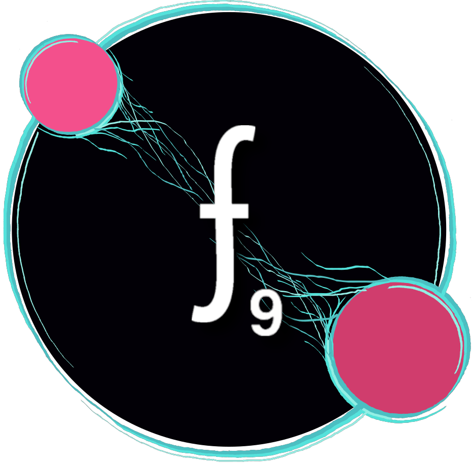

As <strong><u>Jornadas da Engenharia Física</u></strong> são um evento anual, que não só permite dar aos alunos de Engenharia Física Tecnológica conhecimento de opções para o seu futuro e oportunidades de contacto com empresas, como também divulgar a Física entre o público em geral.

As <u>JEF 10</u> decorreram nos dias <strong><u>21, 22 e 23 de Fevereiro de 2024</u></strong>. Foram 3 dias recheados com atividades como Palestras, Workshops, Coffee with the Physicists/Alumni e um Quizz.
